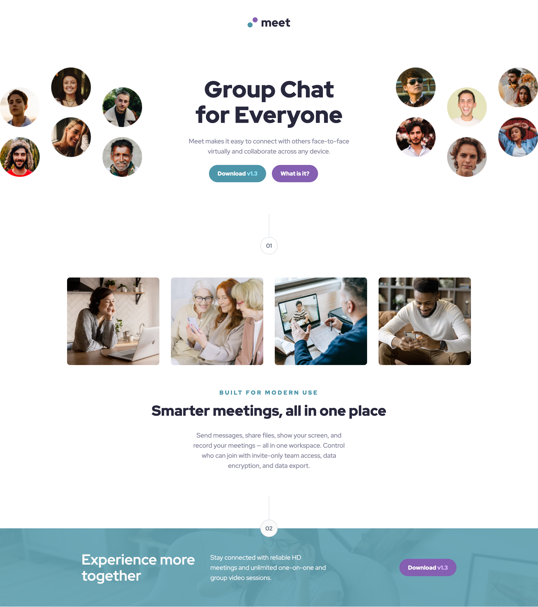

# Frontend Mentor - Meet landing page solution

This is a solution to the [Meet landing page challenge on Frontend Mentor](https://www.frontendmentor.io/challenges/meet-landing-page-rbTDS6OUR). Frontend Mentor challenges help you improve your coding skills by building realistic projects.

## Table of contents

- [Overview](#overview)
  - [The challenge](#the-challenge)
  - [Screenshot](#screenshot)
  - [Links](#links)
- [My process](#my-process)
  - [Built with](#built-with)
  - [What I learned](#what-i-learned)
- [Author](#author)

## Overview

### The challenge

Users should be able to:

- View the optimal layout depending on their device's screen size
- See hover states for interactive elements

### Screenshot

### Links

- Solution URL: [GitHub Repo](https://github.com/rainbowsurfer137/meeting-landing-page)
- Live Site URL: [Live Demo](https://rainbowsurfer137.github.io/meeting-landing-page/)

## My process

### Built with

- Semantic HTML5
- Tailwind CSS
- CSS Grid & Flexbox
- Mobile-first workflow
- Vite

### What I learned

- How to structure responsive layouts using CSS Grid and Tailwind utility classes
- Managing image bleed and background overlays for modern layout effects
- Deploying a Vite + Tailwind project to GitHub Pages with custom `vite.config.js`

## Author

- Frontend Mentor - [@rainbowsurfer137](https://www.frontendmentor.io/profile/rainbowsurfer137)
- GitHub - [rainbowsurfer137](https://github.com/rainbowsurfer137)
